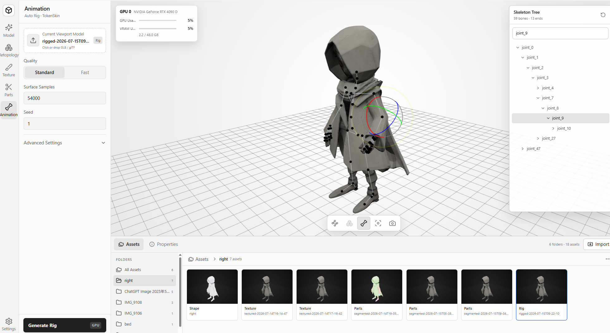

<p align="center">
  <samp>
&nbsp;&nbsp;_______&nbsp;____&nbsp;&nbsp;_____&nbsp;_&nbsp;&nbsp;&nbsp;&nbsp;&nbsp;_&nbsp;&nbsp;&nbsp;&nbsp;&nbsp;___&nbsp;____&nbsp;&nbsp;____&nbsp;&nbsp;&nbsp;&nbsp;____<br>
&nbsp;|__&nbsp;&nbsp;&nbsp;__|&nbsp;&nbsp;_&nbsp;\|&nbsp;____|&nbsp;|&nbsp;&nbsp;&nbsp;|&nbsp;|&nbsp;&nbsp;&nbsp;|_&nbsp;_/&nbsp;___||___&nbsp;\&nbsp;&nbsp;/&nbsp;___|<br>
&nbsp;&nbsp;&nbsp;&nbsp;|&nbsp;|&nbsp;&nbsp;|&nbsp;|_)&nbsp;|&nbsp;&nbsp;_|&nbsp;|&nbsp;|&nbsp;&nbsp;&nbsp;|&nbsp;|&nbsp;&nbsp;&nbsp;&nbsp;|&nbsp;|\___&nbsp;\&nbsp;&nbsp;__)&nbsp;||&nbsp;|<br>
&nbsp;&nbsp;&nbsp;&nbsp;|&nbsp;|&nbsp;&nbsp;|&nbsp;&nbsp;_&nbsp;&lt;|&nbsp;|___|&nbsp;|___|&nbsp;|___&nbsp;|&nbsp;|&nbsp;___)&nbsp;|/&nbsp;__/&nbsp;|&nbsp;|___<br>
&nbsp;&nbsp;&nbsp;&nbsp;|_|&nbsp;&nbsp;|_|&nbsp;\_\_____|_____|_____|___|____/|_____(_)____|<br>
<br>
&nbsp;&nbsp;&nbsp;&nbsp;&nbsp;&nbsp;&nbsp;&nbsp;&nbsp;&nbsp;&nbsp;&nbsp;&nbsp;&nbsp;&nbsp;&nbsp;&nbsp;trellis2.c&nbsp;3D&nbsp;Local&nbsp;Gen&nbsp;All-in-One
  </samp>
</p>

<p align="center">
  
</p>

`trellis2.c` is an all-in-one local 3D generation toolkit powered by TRELLIS.2,
Pixal3D, SegViGen, and TokenSkin. It includes image-to-3D generation, mesh
texturing, automatic part decomposition, and automatic rigging. Inference runs
entirely on native CUDA or Vulkan, with no Python or PyTorch runtime.

<p align="center">
  <a href="https://github.com/Wimacs/trellis2.c/releases/download/v0.1.0/Trellis-Studio-0.1.0-Windows-x64-Setup.exe"></a>
  <a href="https://discord.gg/HNW54eYSx"></a>
</p>

## Build

Requirements:

- Git and CMake 3.22 or newer.
- A C/C++ toolchain: GCC/Clang on Linux or Visual Studio 2022 on Windows.
- The Vulkan SDK, including the loader, headers, and `glslc`.
- The CUDA Toolkit when building the CUDA backend.
- OpenGL and X11 development packages on Linux when building the bundled
  raylib viewer.

The Vulkan SDK is required for both inference backends because the pipeline
tools also build the Vulkan mesh postprocessor and texture baker.

Clone the repository with all submodules:

```sh
git clone --recursive https://github.com/Wimacs/trellis2.c.git
cd trellis2.c
```

If the repository was cloned without submodules:

```sh
git submodule update --init --recursive
```

### Linux

CUDA:

```sh
cmake -S . -B build-cuda \
  -DCMAKE_BUILD_TYPE=Release \
  -DTRELLIS2_C_BACKEND=cuda
cmake --build build-cuda -j
```

Vulkan:

```sh
cmake -S . -B build-vulkan \
  -DCMAKE_BUILD_TYPE=Release \
  -DTRELLIS2_C_BACKEND=vulkan
cmake --build build-vulkan -j
```

### Windows

Run from a Visual Studio developer shell.

CUDA:

```powershell
cmake -S . -B build-win -G "Visual Studio 17 2022" -A x64 `
  -DTRELLIS2_C_BACKEND=cuda
cmake --build build-win --config Release --parallel
```

Vulkan:

```powershell
cmake -S . -B build-win-vulkan -G "Visual Studio 17 2022" -A x64 `
  -DTRELLIS2_C_BACKEND=vulkan
cmake --build build-win-vulkan --config Release --parallel
```

CUDA defaults to compute capability 8.9. Set
`-DCMAKE_CUDA_ARCHITECTURES=<SM>` for another GPU generation. For CLI-only
builds, add `-DTRELLIS2_C_BUILD_RAYLIB_VIEWER=OFF`; add
`-DTRELLIS2_C_BUILD_TESTS=OFF` when the test binaries are not needed.

The examples below use `./build-cuda/`. Use `./build-vulkan/` for a Vulkan
build, `./build-win/Release/` for Windows CUDA, or
`./build-win-vulkan/Release/` for Windows Vulkan. The backend is compiled into
the executable and does not require a different command-line flag.

## Pipelines

The examples assume that the corresponding model packages have already been
downloaded or converted. TRELLIS.2, DINOv3, and BiRefNet can use the layout
created by `tools/download_weights.py`; conversion helpers for NAF, SegviGen,
and TokenSkin are also provided under `tools/`.

### `trellis2-image-to-gltf`

Generates a textured 3D asset from one image with TRELLIS.2. The complete path
prepares the foreground, encodes the image with DINOv3, generates and decodes
the shape, cleans the topology, generates PBR textures, and exports GLB/glTF.
The default profile is `512`; `--pipeline 1024` selects the 1024 profile.
`--shape-only` skips texture generation.

```sh
./build-cuda/trellis2-image-to-gltf \
  --model ../TRELLIS.2/TRELLIS.2-4B \
  --dino ../TRELLIS.2/dinov3-vitl16-pretrain-lvd1689m \
  --image example_image/T.png \
  --pipeline 1024 \
  --output output.glb
```

For opaque input, an auto-discovered BiRefNet checkpoint is used when
available; transparent RGBA input is used directly.

### `pixal3d-image-to-gltf`

Generates a textured 3D asset with Pixal3D's NAF and projected-image
conditioning. It defaults to `1024_cascade`; use
`--pipeline 1536_cascade` for the larger cascade. NAF is discovered at
`MODEL/ckpts/naf_release.safetensors` or can be supplied with `--naf`.

```sh
./build-cuda/pixal3d-image-to-gltf \
  --model ../Pixal3D/Pixal3D \
  --dino ../TRELLIS.2/dinov3-vitl16-pretrain-lvd1689m \
  --image example_image/T.png \
  --output pixal3d.glb
```

Opaque input also requires an auto-discovered BiRefNet checkpoint or an
explicit `--birefnet FILE`; transparent RGBA input does not.

### `trellis2-texture-mesh`

Generates new PBR materials for an existing triangle mesh from a reference
image. It encodes the mesh as a TRELLIS.2 shape latent, runs the texture flow
and decoder, and writes a new static GLB. Because the asset is rebuilt, source
node hierarchy, materials, UVs, skins, animations, and VRM extensions are not
preserved.

```sh
./build-cuda/trellis2-texture-mesh \
  --model ../TRELLIS.2/TRELLIS.2-4B \
  --dino ../TRELLIS.2/dinov3-vitl16-pretrain-lvd1689m \
  --input input.glb \
  --image reference.png \
  --output textured.glb
```

Opaque reference images require BiRefNet. A prepared foreground image can be
passed with `--image-prepared`.

### `trellis2-segment-mesh`

Automatically decomposes a static GLB/glTF mesh with SegViGen Full. When no
condition image is supplied, the pipeline renders one from a fixed camera,
predicts part labels, separates connected components, and writes one assembly
GLB with one selectable node and mesh per physical part. The default output
preserves every source face exactly once together with mappable standard
vertex attributes, materials, and textures.

```sh
./build-cuda/trellis2-segment-mesh \
  --model ../TRELLIS.2/TRELLIS.2-4B \
  --segmentation-model ../SegviGen \
  --dino ../TRELLIS.2/dinov3-vitl16-pretrain-lvd1689m \
  --input input.glb \
  --output parts.glb
```

`--small-part-mode keep|merge|discard` controls disconnected micro-shells;
`discard` intentionally removes their faces. The pipeline does not generate
cut surfaces or caps, so separated parts are not guaranteed to be watertight.
Inputs whose skins, animations, morphs, instancing, or extensions cannot be
preserved correctly are rejected.

### `tokenskin-rig`

Automatically rigs an existing GLB/glTF mesh with TokenSkin. The output GLB
contains the generated skeleton, joints, inverse bind matrices, and skin
weights. Flattened world-space geometry and standard PBR appearance are
preserved; source node hierarchy, morph targets, and existing animations are
not.

```sh
./build-cuda/tokenskin-rig \
  --model models/tokenskin \
  --input input.glb \
  --output rigged.glb
```

## License

The original source code and documentation authored for this project are
licensed under the [MIT License](LICENSE).

Third-party code under `3rd/`, files carrying their own notices, model
weights, datasets, input files, sample assets, and generated outputs are not
relicensed by the project MIT License. See
[THIRD_PARTY_NOTICES.md](THIRD_PARTY_NOTICES.md) and preserve the license files
provided by each dependency and model source.

In particular, DINOv3 weights use Meta's **DINOv3 License, not MIT**. A mirror
or converted checkpoint does not remove its redistribution, use, and
trade-control conditions. The release packages contain no model weights; the
weight downloader keeps upstream model cards and license files where
available.
